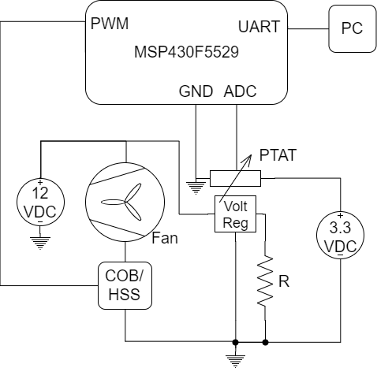

# Milestone 2: Closed Loop Systems
## Details
 * By Scott Wood and David Sheppard
 * Created: 11 November 2018
 * Last Updated: 1 December 2018 - Commented rest of code
## Purpose
Reads in data from a PTAT and uses the info to control a fan by PWM in order to maintain a desired temperature on the PTAT.
## Use
### Setting Desired Temperature
The desired temperature can be changed by sending a number (in degrees C) over UART.
### Reading Current Temperature
The current temperature can be read by sending a value of 0 over UART which prompts the device to send the current temperature back through the TX line.
### Defaults
The desired temperature is initialized to 20 C.
## Implementation
### Specs
* The code is designed for the MSP430F5529 microprocessor
* The PTAT (proportional to absolute temperature) device that the code was designed for is the LM60CIZ.
* The PTAT equation is given as follows: Vo = 6.25 mV/&#176;C + 424 mV from <a href="http://www.ti.com/lit/ds/symlink/lm60.pdf">the datasheet</a>.
### Temperature Reading
The temperature is read using the ADC Converter built into the microprocessor.
### PWM
Pulse width modulation is done in the software using Timer A1 in Up Mode.
### Ports:   
 * 6.0: ADC input
 * 2.7: PWM output
 * 4.4: TX
 * 4.5: RX
 ## Block Diagram of Ciruit Setup
 In the circuit, the votlage regulator acts as a heat source and the PTAT is pressed against it to read the temperature. The fan and regulator are supplied by a 12 VDC source and the PTAT and microprocessor recieve 3.3 VDC.
 

## Notes
* Some of the code was taken from sample code in the TI resource explorer.
* The code is dependenty upon the MSP430G2553.h header file.
